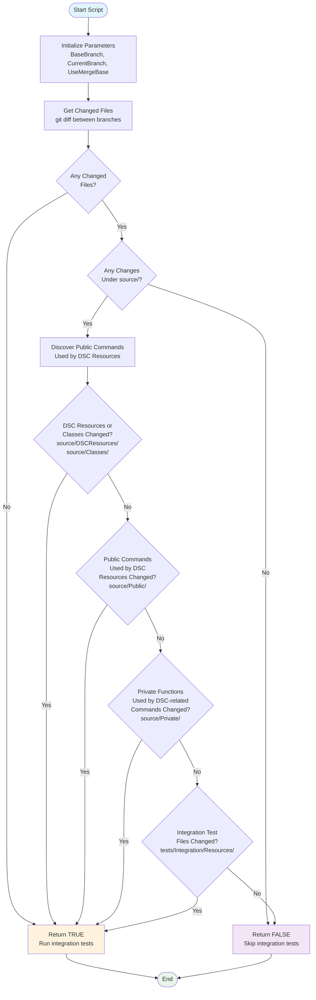

# .build scripts

Documentation for the SqlServerDsc module build and pipeline scripts.

## `Test-ShouldRunDscResourceIntegrationTests.ps1`

This script dynamically determines whether DSC resource integration tests
should run in Azure Pipelines.

### What the Script Does
<!-- markdownlint-disable-next-line MD013 -->
The [`Test-ShouldRunDscResourceIntegrationTests.ps1`](./Test-ShouldRunDscResourceIntegrationTests.ps1) script analyzes git
changes between two references and determines if DSC resource integration tests
need to run. It automatically discovers which public commands are used by DSC
resources and classes, then checks if any relevant files have been modified.

### How It Works

The script performs an optimized analysis by checking for changes in this order:

1. **Early Source Check**: First checks if any files under `source/` have changed
   - If no source changes, skips integration tests immediately
1. **DSC Resources**: Files under `source/DSCResources/`
1. **Classes**: Files under `source/Classes/`
1. **Public Commands**: Commands that are actually used by DSC resources or
   classes (dynamically discovered)
1. **Private Functions**: Functions used by the monitored public commands or
   class-based DSC resources
1. **Integration Tests**: DSC resource integration test files under
   `tests/Integration/Resources/`

### Flow Diagram

The following diagram illustrates the decision flow of the script:

<!-- markdownlint-disable MD013 - Mermaid diagram has long lines -->

<!-- markdownlint-enable MD013 -->

### Parameters

| Parameter | Type | Default | Purpose |
|-----------|------|---------|---------|
| `BaseBranch` | String | `'origin/main'` | Base branch to compare against |
| `CurrentBranch` | String | `'HEAD'` | Current branch or commit to compare |
| `UseMergeBase` | Switch | `$false` | Use merge-base to compute diff base |

### Outputs

<!-- markdownlint-disable MD013 - Table with long descriptions -->
| Output | Type | Description |
|--------|------|-------------|
| Return value | Boolean | `$true` when the monitored categories have relevant changes between the specified refs, `$false` when no such changes are detected |
<!-- markdownlint-enable MD013 -->

### Usage

#### Azure Pipelines

The Azure Pipelines task sets an output variable that downstream stages can
use to conditionally run DSC resource integration tests. The script returns
a boolean value that the pipeline captures, e.g.:

<!-- markdownlint-disable MD013 -->
```yaml
- powershell: |
    $shouldRun = & ./.build/Test-ShouldRunDscResourceIntegrationTests.ps1 -BaseBranch $targetBranch -CurrentBranch HEAD -UseMergeBase
    Write-Host "##vso[task.setvariable variable=ShouldRunDscResourceIntegrationTests;isOutput=true]$shouldRun"
  displayName: 'Determine if DSC resource tests should run'
  name: determineShouldRun
```
<!-- markdownlint-enable MD013 -->

Downstream stages reference this output variable in a stage `condition:`
using the pattern:
<!-- markdownlint-disable MD013 -->
```yaml
condition: |
and(
   succeeded(),
   eq(lower(dependencies.stageName.outputs['jobName.taskName.ShouldRunDscResourceIntegrationTests']), 'true')
)
```
<!-- markdownlint-enable MD013 -->

#### Command Line

```powershell
# Basic usage (compares current HEAD with origin/main)
.build/Test-ShouldRunDscResourceIntegrationTests.ps1

# Custom branches
.build/Test-ShouldRunDscResourceIntegrationTests.ps1 -BaseBranch 'origin/dev' \
    -CurrentBranch 'feature-branch'
```
